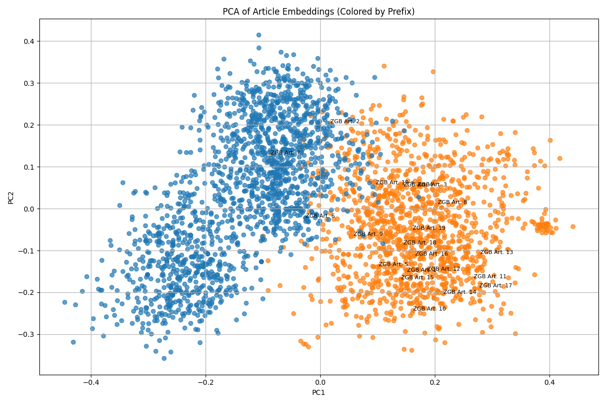

# Swiss Legal QA App
Demo App showing the power of combining classical information retrieval with LLMs.

## Pipeline
### Pre-processing
### 1. **Source**

The legal texts are sourced from the legally binding German version of the **Swiss Civil Code**, available via the [Official Swiss Federal Law Database](https://www.fedlex.admin.ch/eli/cc/24/233_245_233/de). 
All texts were translated into English using the machine translation model [`Helsinki-NLP/opus-mt-de-en`](https://huggingface.co/Helsinki-NLP/opus-mt-de-en), except for the **Code of Obligations**, where the official English translation was used.

2. **Data Extraction**  
   Articles are extracted and converted into a structured CSV format using a combination of manual and LLM parsing.

3. **Embedding Generation**  
   Each article is embedded using `Xenova/paraphrase-MiniLM-L6-v2`, producing 384-dimensional vectors.

Below, one can see the visualization of the 2d PCA of the articles embeddings (OR-blue, ZGB-orange)



---

### Runtime Flow

1. **User Input**  
   A legal question is entered through the app interface.

2. **Initial GPT Response**  
   The question is passed to OpenAI’s API to generate a *raw* legal-style answer.

3. **Question Embedding**  
   The generated response is embedded using `Xenova/paraphrase-MiniLM-L6-v2`.

4. **Similarity Search**  
   Cosine similarity is computed between the embedded answer and all article embeddings.

5. **Top-20 Retrieval**  
   The top 20 most relevant legal articles are selected based on similarity scores.

6. **Final GPT Query**  
   The original question and retrieved relevant articles are fed into a second OpenAI API call to generate the final answer.

7. **Response Output**  
   - Legal answer is returned, including proper citations.  
   - Top-20 articles displayed with their similarity score.


## Environment Variables

- `OPENAI_API_KEY`: Your OpenAI API key

# Main code

## Preprocessing
### Load Model:
```typescript
import { pipeline } from '@xenova/transformers';
const embedder = await pipeline('feature-extraction', 'Xenova/paraphrase-MiniLM-L6-v2') as EmbedderFunction;
```

### Embed Articles:
```typescript
const batchSize = 10;
  for (let i = 0; i < articles.length; i += batchSize) {
    const batch = articles.slice(i, i + batchSize);
    console.log(`Processing batch ${i/batchSize + 1} of ${Math.ceil(articles.length/batchSize)}`);
    
    for (const article of batch) {
      try {
        // Create the input string
        const embedInput = `${article.article_text}`;

        // Split long text into chunks
        const words = embedInput.split(/\s+/);
        const chunks: string[] = [];
        let currentChunk: string[] = [];
        let currentLength = 0;

        for (const word of words) {
          if (currentLength + word.length + 1 > MAX_TOKENS) {
            chunks.push(currentChunk.join(' '));
            currentChunk = [word];
            currentLength = word.length;
          } else {
            currentChunk.push(word);
            currentLength += word.length + 1;
          }
        }
        if (currentChunk.length > 0) {
          chunks.push(currentChunk.join(' '));
        }

        console.log(`Article ${article.article_number}: ${chunks.length} chunks`);

        // Get embeddings for each chunk
        const chunkEmbeddings = await Promise.all(
          chunks.map(chunk => embedder(chunk, {
            pooling: 'mean',
            normalize: true
          }))
        );

        // Average the embeddings
        const embeddingSize = chunkEmbeddings[0].data.length;
        const averagedEmbedding = new Array(embeddingSize).fill(0);
        
        for (const chunkEmbedding of chunkEmbeddings) {
          const embedding = Array.from(chunkEmbedding.data);
          for (let i = 0; i < embeddingSize; i++) {
            averagedEmbedding[i] += embedding[i] / chunkEmbeddings.length;
          }
        }
```

## Runtime Backend
### OpenAI API Call to get initial answer
```typescript
async function getOpenAIAnswer(question, context) {
    const messages = [
        {
         role: "system",
         content: context 
           ? "You are a swiss legal expert. Answer the question with the help of the provided articles. Cite the specific articles you reference using their article numbers."
           : "You are a swiss legal expert. Provide a concise, factual answer to the legal question, using formal legal language."
        },
        {
            role: "user",
            content: context
                ? `Question: ${question}\n\nRelevant articles:\n${context}`
                : question
        }
    ];
    const response = await fetch('https://api.openai.com/v1/chat/completions', {
        method: 'POST',
        headers: {
            'Content-Type': 'application/json',
            'Authorization': `Bearer sk-...`
        },
        body: JSON.stringify({
            model: "gpt-3.5-turbo",
            messages,
            max_tokens: 300
        })
    });
    if (!response.ok) {
        throw new Error(`OpenAI API error: ${response.statusText}`);
    }
    const data = await response.json();
    return data.choices[0].message.content;
}
```
### Cosine Similarity
```typescript
function cosineSimilarity(vecA, vecB) {
    const dotProduct = vecA.reduce((sum, a, i) => sum + a * vecB[i], 0);
    const magnitudeA = Math.sqrt(vecA.reduce((sum, a) => sum + a * a, 0));
    const magnitudeB = Math.sqrt(vecB.reduce((sum, b) => sum + b * b, 0));
    return dotProduct / (magnitudeA * magnitudeB);
}
```

### Main Processing part
```typescript
async function processLegalQuestion(question) {
    // Load text embedder 
    const embedder = await (0, transformers_1.pipeline)('feature-extraction', 'Xenova/paraphrase-MiniLM-L6-v2');
    // Get initial answer from OpenAI
    const initialAnswer = await getOpenAIAnswer(question);

    // Load article embeddings
    console.log('Loading article embeddings...');
    const embeddingsData = JSON.parse(fs.readFileSync('article_embeddings.json', 'utf-8'));

    // Create embeddings for initial answer
    const answerEmbedding = await embedder(initialAnswer, {
        pooling: 'mean',
        normalize: true
    });

    // Calculate cosine similarities
    const similarities = embeddingsData
        .map(article => ({
        article_number: article.article_number,
        similarity: cosineSimilarity(answerEmbedding, article.embedding),
        text: article.text
    }));
    // Sort by similarity and get top 20
    const topArticles = similarities
        .sort((a, b) => b.similarity - a.similarity)
        .slice(0, 20);

    // Concatenate articles with their numbers
    const articlesContext = topArticles
        .map(article => `Article ${article.article_number}:\n${article.text}`)
        .join('\n\n');

    // Get final answer using the articles as context
    const finalAnswer = await getOpenAIAnswer(question, articlesContext);
    console.log('\nFinal Answer:', finalAnswer);
    return {
        question,
        initialAnswer,
        finalAnswer,
        topArticles
    };
}
```
## Example
**Question:** 
An elderly woman with dementia gifts CHF 100,000 to her new caregiver. Can her children challenge the gift after her death?

**GPT Initial Answer:** 
Under Swiss law, gifts made by individuals suffering from dementia may be challenged by their heirs if it can be proven that the donor lacked the necessary mental capacity to comprehend the consequences of the gift at the time it was made. The burden of proof lies with the heirs to demonstrate that the donor was not capable of understanding the nature and consequences of the gift. If the court determines that the donor lacked capacity at the time of the gift, it may be declared null and void, and the amount may be reclaimed for the estate to be distributed among the heirs according to the law of succession.

**Our Answer (GPT + articles retrieval)**:
In the scenario provided, where an elderly woman with dementia gifts CHF 100,000 to her new caregiver, her children may challenge the gift after her death under certain circumstances. According to Swiss law, a gift can be revoked under specific conditions as outlined in Articles OR Art. 249 and OR Art. 251. These include instances where the recipient has committed a serious criminal offense against the donor, grossly neglected duties under family law towards the donor, or failed to fulfill the provisos attached to the gift.

Additionally, the heirs of the donor may have the right to challenge the gift if the recipient has wilfully and unlawfully caused the donor's death or prevented the donor from exercising their right of revocation (Article OR Art. 251). The heirs would need to act within the time frame specified in the law to exercise their right of challenge or revocation of the gift.

Furthermore, if the gift was given within the last five years before the donor's death, and it is found that the gift was made to circumvent the payment of credit or to reduce the inheritance benefits, the heirs may have grounds to challenge the gift under Article ZGB Art. 494.

In conclusion, in the case of an elderly woman with dementia gifting a substantial amount to her caregiver, her children may challenge the gift after her death based on the specific legal grounds outlined above.


## Future Improvements

1. **Add more granularity to the article retrieval**  
   First decide whether the question should be studied through ZGB or OR, or even both, then do a similarity search only on relevant articles => reduce false positives.

2. **Bring in Court Decisions**  
   Use Swiss court rulings as an additional knowledge source. These decisions often provide practical interpretations of the law and could make the answers more grounded and useful.

3. **Support Multiple Languages**  
   Work with the original legal texts in German, French, and Italian the binding versions of the law.  
   Translate user questions into each language, run the same retrieval process, and combine the results.  
   This would also help with court decisions, which are often published in only one of the three languages.


## License

MIT
